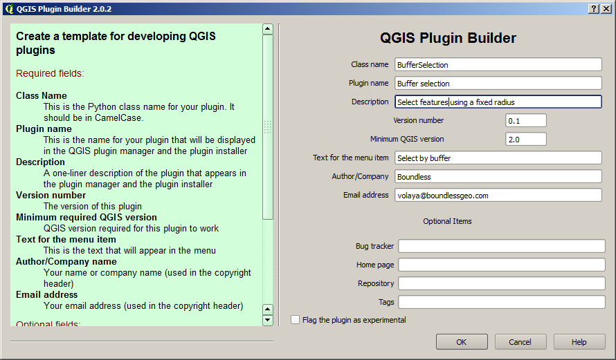
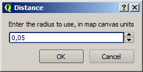
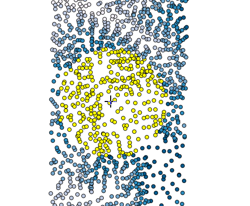

A buffer selection plugin. Introduction map tools
===================================================

Introduction
*************

In this lesson we will create a plugin that allows you to select point in the map canvas and selects all features that are within a given radius from that point. We will see how to use a map tools (a tool that responds to actions on the map canvas) to implement it.


Source Code
************

The plugin of this example plugin is available at the ``python/buffer_selection`` folder. It is recommended to try yourself to create it following the steps described below, before using the provided plugin code.

Creating the plugin base
*************************

To create the plugin skeleton, use the Plugin Builder with the following configuration.



Plugin implementation
**********************

Map tools provide functionality to interact with the QGIS canvas by clicking or dragging on it, and you can use a plugin to add new map tools. We are going to see an example of a plugin that adds a tool to perform a buffer selection. When the tool is active, clicking on the canvas will cause all features within a given radius to be selected from the active layer.

The first thing we need is a menu entry to enable the tool, which, as usual, will be added in the ``initGui()`` method and removed in the ``unload()`` method. That code should have been added by the Plugin Builder, so we do not hvae to edit it manually. We must, however, initialize the map tool so it can be later used and there is no need to initialize it each time that it's requested.

The code of the ``initGui()`` method should look like this. The last line is the only one that we have added manually.

::

    def initGui(self):
        # Create action that will start plugin configuration
        self.action = QAction(
            QIcon(":/plugins/bufferselection/icon.png"),
            u"Select by buffer", self.iface.mainWindow())
        # connect the action to the run method
        self.action.triggered.connect(self.run)

        # Add toolbar button and menu item
        self.iface.addToolBarIcon(self.action)
        self.iface.addPluginToMenu(u"&Buffer selection", self.action)

        self.tool = BufferSelectionMapTool(self.iface.mapCanvas())

The ``BufferSelectionMapTool`` class is not created by the Plugin Builder. We will in a separate module. Don't forget to add the corresponding import to the main plugin file.

The class has the following code:

::

  class BufferSelectionMapTool(QgsMapToolEmitPoint):

    def __init__(self, canvas, distance = 1):
          self.canvas = canvas      
          self.distance = 1
          QgsMapToolEmitPoint.__init__(self, self.canvas)        
        
    def canvasPressEvent(self, e):      
        currentLayer = self.canvas.currentLayer()
          if currentLayer.type() == QgsMapLayer.VectorLayer:
            toSelect = []
            pt = self.toLayerCoordinates(currentLayer, e.pos()) 
            ptGeom = QgsGeometry.fromPoint(pt)    
            features = currentLayer.getFeatures()
            for feature in features:
              geom = feature.geometry()
              distance = geom.distance(ptGeom)            
              if distance < self.distance:
                toSelect.append(feature.id())

            currentLayer.setSelectedFeatures(toSelect)


There are several classes that inherit from QgsMapTool. In our case, the QgsMapToolEmitPoint is the one that fits better in our plugin, since we want to capture single click on the canvas. To implement the desired behaviour, we can override the ``canvasMoveEvent(), canvasPressEvent()`` and ```canvasReleaseEvent ()`` methods. The first or them is enough in this case.

When the canvas is clicked and our tools is the current map tool, the ``canvasPressEvent`` is called, and receives an event from which the position that was clicked can be obtained. This position is, however, in screen coordinates, but there are some useful method in the ``QgsMapTool`` class that can be used to convert easily from screen coordinates to layer coordinates. 

Once we have the current layer and the coordinates of the click event in the same coordinate system as that layer, we can iterate over all its features and measure the distance between each feature and the clicked point. Based on that we create a list that contains the IDs of the features to select. Those IDs are needed to refer to a feature in many operations that can be performed with a vector layer, and selection is one of them.

In the last line, we change the selection to contain just the features within the specified distance.

The last step now is to set the tool as the current map tool when the user select the menu item. The corresponding menu action calls the ``run()`` method, which should have the following code

::

  # run method that performs all the real work
  def run(self):
      distance, ok = QInputDialog.getDouble(self.iface.mainWindow(), 
                      "Distance", "Enter the radius to use, in map canvas units", min = 0, decimals = 6)
      if ok:
          self.tool.distance = distance
          self.iface.mapCanvas().setMapTool(self.tool)

The tool is set as the active one, and will be waiting to receive events when the user clicks on the canvas.

Compile and copy the plugin code, and test the plugin as usual.






Additional work
****************

The following are some suggestions for extra work.

- Instead of a regular menu item, try to set a meu item that is highlighted when the tool is active. Hint: the ``deactivate`` method is called when the tool is replaced as the current map tool. You can use that to know when the menu item should be deactivated as well.

- Try to iplement different selection behaviours if the Ctrl or Shift keys are pressed, so the selection does not replace the previous one, but instead, it is added to it, or the intersection of both is set as the new selections.


