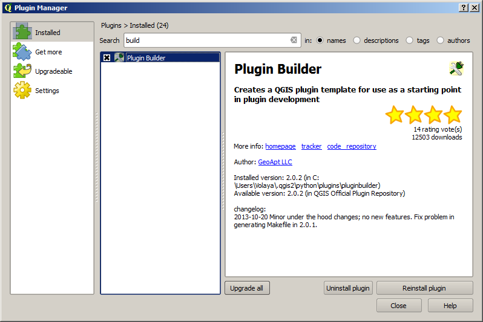
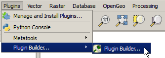
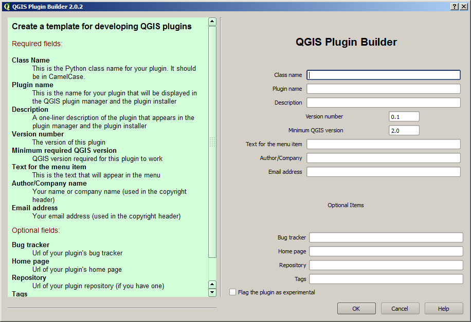
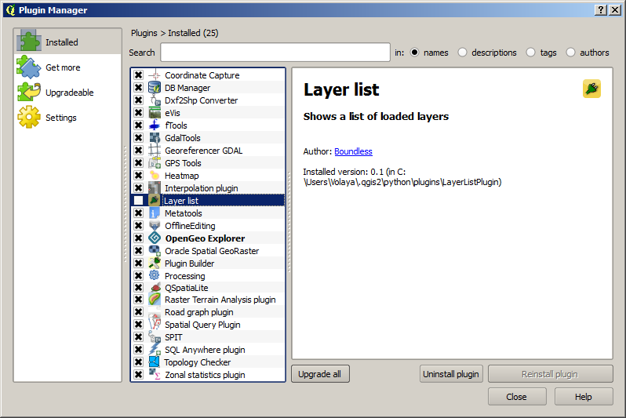
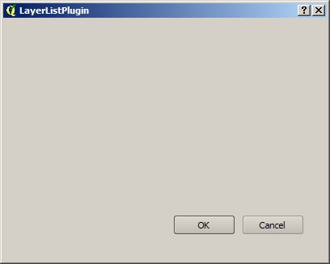
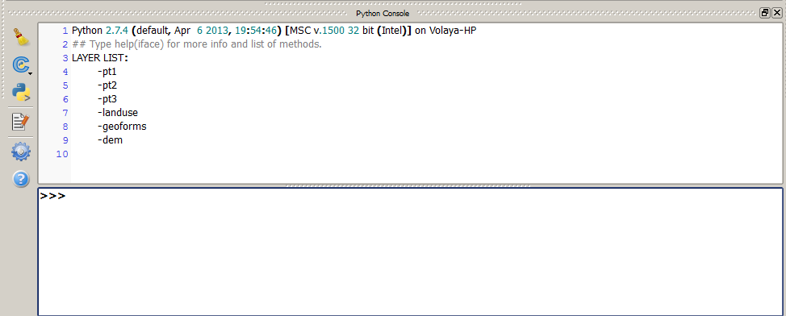

Our first plugin: a plugin to show a list of layers
===================================================

Introduction
*************

In this lesson we will create a plugin that shows a list of all layers currently loaded in QGIS. It introduces the basic ideas about creating a plugin, and we will see how to retrieve some simple data from our QGIS instance. 

Source Code
************

The plugin of this example plugin is available at the ``python/layer_list`` folder. It is recommended to try yourself to create it following the steps described below, before using the provided plugin code.

Creating the plugin base
*************************

To create a Python plugin for QGIS we need the following elements:

- Python files with the code of the plugin, with a specific entry point and methods to be called by QGIS when starting the plugin
- A metadata file with the description of the plugin

If you plugin contains some kind of UI, you can create it manually and write the corresponding Python files directly, but it is easier to use the QT Designer, which will create files that can later be converted into Python files. In this case, it is a good idea to have some kind of script to 

The code of the plugin has to be copied to the QGIS plugins folder, so QGIS can find it and load it, and it is convenient to have a script to do that as well.

As you can see, setting up a basic skeleton for a plugin can take some time. Instead of doing this previous work manually, we will use a very useful plugin: the *Plugin Builder*. This is a QGIS plugin that does all this work for us, so later we just have to design our UI, implement the actual plugin code, and run the provided scripts.

Since it is a QGIS plugin, it has to be run from QGIS. Open QGIS and open the Plugin manager (*Plugins/Manage and install plugins...* menu)

Search for the Plugin Builder plugin, and install it. Close the plugin manager and you should have the plugin already available under the *Plugins* menu.

Open it.

We just need to fill the fields in that form and the plugin will take care of creating the plugin skeleton based on them.

The plugin that we will be creating for this first example will display a small dialog with a list of the layers currently available in QGIS. Use the values shown below to provide the Plugin Builder with the information it needs about our plugin.

Let's discuss those parameters in detail.

- Class name. this is the name of the main class that will be run when the plugin is loaded

- Plugin Name. This name will appear in the plugin manager. It will also appear in the menu under the *Plugins* menu item, to identify all actions associated with the plugin

- Description. A more verbose description

- Version number. Version of this plugin

- Minimum required QGIS version. We will be using 2.0 for this field in all the plugins in this manual. There have been important changes in the QGIS API for version 2.0, so most of the plugins will not work on previous versions of QGIS. This will inform QGIS about that, so our plugins are not shown as available when using a version older than the required version.

We will not be using the optional parameters in the lower part of the form. Feel free to enter them if you want to provide more information.

Once you have provided this input, click on OK and select a folder in your filesystem. A new folder will be created under that folder, with the name that you specified for you plugin, and it will contain all the necessary classes. 

The plugin contains some UI files that have to be compiled before they can be used by QGIS. There is a make file in the plugin folder that contains several targets, among them one named ``compile`` which will take care of compiling them.

Open a console, move to the plugin folder and type the following.

::

	make compile

A fully functional plugin (although one that does nothing yet) is now available in the folder that you entered. However, if you now start QGIS, you will not see it. That is because QGIS looks for plugins in a given folder, which is not the one where our code is. To make it visible to QGIS, you have to put it in the QGIS plugins folder folder. If you are in a Windows machine it should be something like ``C:\Users\<your_user>\.qgis2\python\plugins``. In Linux/Mac, it should be in ~/.qgis2/python/plugins``. 

To put your code there, you can copy it manually or create a symlink to the plugin folder (the ``LayerListPlugin`` folder). Also, you can use the make file that the Plugin Builder has created for you, which has a ``deploy`` target that does exactly that. 

.. note:: if you are on Windows, this target will not work, since it works only in unix-like OSs. You should manually copy the content of the folder and create a `C:\Users\<your_user>\.qgis2\python\plugins\LayerListPlugin`` folder)

Open a console, move to the plugin folder an run that target

::

	$ make deploy

The plugin should be already in the QGIS plugin folder.

Restart QGIS and go to the Plugin Manager. The plugin should be there but should appear as disabled.

Enable it by checking its check box. Close the Plugin Manager and you will find a menu entry in *Plugins/Layer list/Show list of layers*. If you select it, the plugin will be executed. 

For now it does nothing but showing empty dialog like this.

Now we will implement the plugin logic to adapt it to what we want.

Plugin implementation
***********************

It's time to implement our ideas and create a plugin that shows a list of layers.  

Let's move to the plugin folder and check its content. You should have the following Python files.

- ``layerlistplugin.py``
- ``layerlistplugindialog.py``.Contains the plugin dialog logic. This first example will not use any UI elements, so you can delete this file safely if you want to clean up
- ``ui_layerlistplugin.py``.  Created by the ``compile`` target based on the ``ui_layerlistplugin.ui``, contains the plugin dialog interface. You can delete both, since we will not be using them
- ``resource_rc.py``.  Created by the ``compile`` target. Contains the resources of the plugin, in this case just the icon used for the menu entry.

As you can see, the only file that we will be working with in this first lesson (which is the most important one of the plugin) is the the file named ``layerlistplugin.py``. That is the main file, where the plugin code can be found. It has the following content (some comments and headers have been removed for the sake of space).

::

	# Import the PyQt and QGIS libraries
	from PyQt4.QtCore import *
	from PyQt4.QtGui import *
	from qgis.core import *
	# Initialize Qt resources from file resources.py
	import resources_rc
	# Import the code for the dialog
	from LayerListPluginplugindialog import LayerListPluginPluginDialog
	import os.path

	class LayerListPluginPlugin:

	    def __init__(self, iface):
	        # Save reference to the QGIS interface
	        self.iface = iface
	        # initialize plugin directory
	        self.plugin_dir = os.path.dirname(__file__)
	        # initialize locale
	        locale = QSettings().value("locale/userLocale")[0:2]
	        localePath = os.path.join(self.plugin_dir, 'i18n', 'LayerListPluginplugin_{}.qm'.format(locale))

	        if os.path.exists(localePath):
	            self.translator = QTranslator()
	            self.translator.load(localePath)

	            if qVersion() > '4.3.3':
	                QCoreApplication.installTranslator(self.translator)

	        # Create the dialog (after translation) and keep reference
	        self.dlg = LayerListPluginPluginDialog()

	    def initGui(self):
	        # Create action that will start plugin configuration
	        self.action = QAction(
	            QIcon(":/plugins/LayerListPluginplugin/icon.png"),
	            u"Show layer list", self.iface.mainWindow())
	        # connect the action to the run method
	        self.action.triggered.connect(self.run)

	        # Add toolbar button and menu item
	        self.iface.addToolBarIcon(self.action)
	        self.iface.addPluginToMenu(u"&Layer list", self.action)

	    def unload(self):
	        # Remove the plugin menu item and icon
	        self.iface.removePluginMenu(u"&Layer list", self.action)
	        self.iface.removeToolBarIcon(self.action)

	    # run method that performs all the real work
	    def run(self):
	        # show the dialog
	        self.dlg.show()
	        # Run the dialog event loop
	        result = self.dlg.exec_()
	        # See if OK was pressed
	        if result == 1:
	            # do something useful (delete the line containing pass and
	            # substitute with your code)
	            pass

Let's discuss the methods in detail.

- ``init(self, iface)``. This method just initializes some fields that can later be used within this class.  The most important variable initialized is the ``iface`` field, which is passed by QGIS when initializing the plugin, and that will be discussed later. Remove the line that initializes the dialog, since we will not be using it, and it will even cause an error if you have removed the file or the corresponding import

::

	# Create the dialog (after translation) and keep reference
	self.dlg = LayerListPluginPluginDialog()

- ``initGui(self)`` Initializes the graphic elements of the plugin. Usually it just adds the menu entries to the QGIS menu bar. This method is called when the plugin is loaded by QGIS.

	Notice that the action is added to the QGIS menu bar using methods from the ``iface`` object. This is an instance of ``QgisInterface`` and is the only way that we have to access QGIS from the plugin. Other than that object, there is no other link between our Python code and the QGIS application were it is supposed to be run. you should pass this object to other classes and modules in case your plugin is split in several of them, or store it in a global variable, so they can interact with QGIS as well.

- ``unload(self)``. This method is run when the plugin is unloaded. This happens when it is disabled in the plugin manager, or when QGIS is closed. The default code just removes the corresponding menu entries from the QGIs menu bar, but if you plugin needs to perform some clean-up (for instance, if it has created temporary files), this is the place where you should put your clean-up code.

- ``run(self)``. Unlike the previous ones, this is not actually a method that is needed by QGIS and it is not called by it. It is called by the action that is added in the ``initGui`` method (see the line ``self.action.triggered.connect(self.run)``). Since that action is the only way we have implemented to execute our plugin from the QGIS interface, all the plugin logic should be implemented in this method.

So, if we want our plugin to display a list of layers, we should implement that in the ``run()`` method, which will be called each time the user clicks on the corresponding menu item. Here is a list of the steps that we should follow.

- Retrieving the list of layers from QGIS
- Creating a string with the list of layer
- Show the string to the user

All those are tasks that can be performed with some basic Python and a few simple calls to the QGIS API. Since we have the ``iface`` object, we can access the QGIS API easily.

To get a list of all available layers, use this code:

::

	layers = self.iface.legendInterface().layers()

Each layer object has a ``name()`` method, so you can create a text list with something like this:

::
	
	s = "LAYER LIST:\n\t-". + "\n\t-".join([layer.name() in layers])

And you can print it directly to the python console.

	print s

If the console is open, ``print `` statements in plugins are output to it.

You can try the above sentences in the console. To mae them part of our plugin, we should put them in the ``run`()`` method instead of the current code, which was automatially generated by the Plugin Builder.

The updated ``run()`` method should look like this.

::

    def run(self):
        layers = self.iface.legendInterface().layers()
        s = "LAYER LIST:\n\t-" + "\n\t-".join([layer.name() for layer in layers])
        print s

Replace that in your ``layerlistplugin.py`` file and then copy the code to your QGIS plugins folder, either manually or using the make file. There is no need to restart QGIS, since we can reload the plugin. To do this, you will need the Plugin Reloader plugin. Make sure it is installed and enabled and then select our plugin as the plugin to reload. Select the reload menu entry and you will see no changes (the new code hasn't added any new menu items), but when you now click on the menu entry, it will code the code that you have just added. Open the Python console, click on the menu entry, and you will see something like this:

The list of QGIS layers is printed out in the console.

You can see that the plugin is just a wrapper for code Python code that can be called from the QGIS Python console, so it gets loaded upon start up and available through the QGIS interface. Once you know how to create scripts in the console and interact with QGIS using its API, creating a plugin should be rather straightforward.

