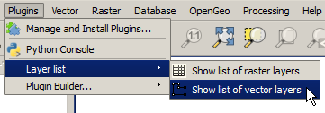

An improved layer list plugin
==================================

Introduction
*************

In this lesson we will improve our first plugin to show the layer list in a message dialog instead of the console. Also we will show the layers divided by types, and with soe additional information. We will learn how to use some methods from the layer objects to work with them.

Source Code
************

The plugin of this example plugin is available at the ``python/layer_list_improved`` folder. It is recommended to try yourself to create it following the steps described below, before using the provided plugin code.

Implementing the plugin code
*****************************

You can create a new plugin skeleton using the Plugin Builder, but it is a better idea to just reuse the one from the previous lesson, as it will happen in a normal plugin project. 

Since we are creating an improved version of the plugin, it would be a good idea to rase the version number to indicate that. Open the ``metadata.txt`` file and you will find something like this:

::

	[general]
	name=Layer list
	qgisMinimumVersion=2.0
	description=Shows a list of loaded layers
	version=0.1
	author=Victor Olaya
	email=volayaf@gmail.com

	# end of mandatory metadata

	# Optional items:

	# Uncomment the following line and add your changelog entries:
	# changelog=

	# tags are comma separated with spaces allowed
	tags=

	homepage=
	tracker=
	repository=
	icon=icon.png
	# experimental flag
	experimental=False

	# deprecated flag (applies to the whole plugin, not just a single version
	deprecated=False

Change the entry corresponding to the version, which was generated based on the information that youo entered when using the Plugin Builder to create this plugin skeleton.

We are going to add two changes to the plugin, namely:

- Replace the *Show list layers* with two menus: *Show list of raster layers* and *Show list of vector layers*
- Extend the layers description
- Show the layers description in a dialog instead of the console

To replace the menu entry, we have to modify the ``intiGui()`` method. It should now look like this

::

    def initGui(self):
        # Create action that will start plugin configuration
        self.showRasterAction = QAction(
            QIcon(":/plugins/layerlistplugin/raster_icon.png"),
            u"Show list of raster layers", self.iface.mainWindow())        
        self.showRasterAction.triggered.connect(self.showRaster)        
        self.iface.addToolBarIcon(self.showRasterAction)
        self.iface.addPluginToMenu(u"&Layer list", self.showRasterAction)

        self.showVectorAction = QAction(
            QIcon(":/plugins/layerlistplugin/vector_icon.png"),
            u"Show list of vector layers", self.iface.mainWindow())        
        self.showVectorAction.triggered.connect(self.showVector)        
        self.iface.addToolBarIcon(self.showVectorAction)
        self.iface.addPluginToMenu(u"&Layer list", self.showVectorAction)

    def unload(self):
        self.iface.removePluginMenu(u"&Layer list", self.showRasterAction)
        self.iface.removePluginMenu(u"&Layer list", self.showVectorAction)
        self.iface.removeToolBarIcon(self.showRasterAction)
        self.iface.removeToolBarIcon(self.showVectorAction)

We have added two actions, both of them as entries in the plugin menu and as buttons in the toolbar. If you do not want the buttons in the toolbar, you can comment out or remove the lines that call ``self.iface.addToolBarIcon``.

Since we are adding more action in the ``initGui()`` method, we should also modify the ``unload()`` method to remove them. Here is the code of that method.

::

	def unload(self):
		self.iface.removePluginMenu(u"&Layer list", self.showRasterAction)
		self.iface.removePluginMenu(u"&Layer list", self.showVectorAction)
        self.iface.removeToolBarIcon(self.showRasterAction)
        self.iface.removeToolBarIcon(self.showVectorAction)

Each action has its own icon, and we are now not using the default ``icon.png`` file the is added by the Plugin Builder. However, changing the icon path is not enough for that to work. That path is a reference to a Qt resource, so we have to make sure that the resource is available. Resources are created when the ``compile`` target is called in the make file, and the information to create them is found in the ``resources.qrc`` file, which looks like this.

::

	<RCC>
    <qresource prefix="/plugins/layerlistplugin" >
        <file>icon.png</file>
    </qresource>
	</RCC>

From this file, the compile task creates a resources file (``resources_rc.py``) that contains the icon in ``icon.png``. To make it use our two new icons instead, we should edit it so it has the following content.

::

	<RCC>
	    <qresource prefix="/plugins/layerlistplugin" >
	        <file>vector_icon.png</file>
	        <file>raster_icon.png</file>
	    </qresource>
	</RCC>

The two actions that we have created are now connected to the ``showRaster`` and ``showVector`` methods. The ``run`` method is not called anymore, so we have to move the logic of the plugin to those two new methods. If you want to keep all the plugin logic in the ``run`` method, you can connect both actions to it with code like this.

::

	self.showRasterAction.triggered.connect(lambda: self.run(RASTER)) 
	self.showVectorAction.triggered.connect(lambda: self.run(VECTOR))

You should define the RASTER and ``VECTOR`` constants, and change the ``run`` method to accept a parameter. We will, however, use the first method and write two new methods instead. 

The ``showRaster`` method looks like this.

::

    def showRaster(self):
        layers = self.iface.legendInterface().layers()
        rasterLayers = [layer for layer in layers if layer.type() == QgsMapLayer.RasterLayer]
        s = "\n*".join(['{} ({})'.format(layer.name(), layer.crs().authid()) for layer in rasterLayers])
        QMessageBox.information(self.iface.mainWindow(), "Raster layer list", s)        

First, we are using the ``type`` method to get the type of the layer and just use the raster ones. Layers can be of three types: ``RasterLayer, VectorLayer`` and ``PluginLayer``. We will see what a ``PluginLayer`` is in another lesson. For now, we can assume that our QGIS project will only have raster or vector layers.

With the list of layers, we create the string that now ontains not jut the name, but a CRS data. All layers have CRS associated, which can be obtained calling the ``crs()`` method. That returns an object of type ``QgsCoordinateReferenceSystem``, and the authority identifier can be obtained calling its ``authid()`` method, which returns a string.

Instead of printing it in the console, we are popping up a message dialog to show it. This uses Qt to create a GUI element, but since it is just a predefined dialog and we haven't used Qt Designer to create it, we have no need of additional files (so we still do not need those extra files that the Plugin Builder created and the we left unused for our first plugin).

The parent window of the dialog is the QGIS main window. We an get a reference to it calling the ``mainWindow()`` of the ``QgisInterface`` object.

The ``showVector`` method is rather similar.

::

    def showVector(self):
        layers = self.iface.legendInterface().layers()
        vectorLayers = [layer for layer in layers if layer.type() == QgsMapLayer.VectorLayer]
        TYPES = ['Point', 'Line', 'Polygon', 'Unknown', 'No geometry']
        s = '\n*'.join(['{}-{} ({})'.format(
                layer.name(), TYPES[layer.geometryType()], layer.crs().authid()) 
                for layer in vectorLayers])
        QMessageBox.information(self.iface.mainWindow(), "Vector layer list", s)

The only difference is that we are adding the geometry type to the description. The ``geomType()`` method returns an integer, which corresponds to the types in the ``TYPES`` list. If you are wondering where those values come from, you can check that by consulting the QGIS API, and you will see that ``geomType()`` returns a value from the ``QGis:GeometryType`` enumeration. As it has been said before, you should use the QGIS API documetation in case you have any doubt about methods and classes, since all the information about the QGIS API is there.

The plugin is reay to be tested. Run the ``compile`` target (those new icons have to be pt in the resources file) and then copy the plugin code to your QGIS plugins folder. Start QGIS and your plugin should be there, with two menu entries this time.

If you have QGIS already running, remember that you can use the Plugin Reloader to reload your plugin and get the changes that we have just made.

Clicking on the *Show list of vector layers* should show something like this.

