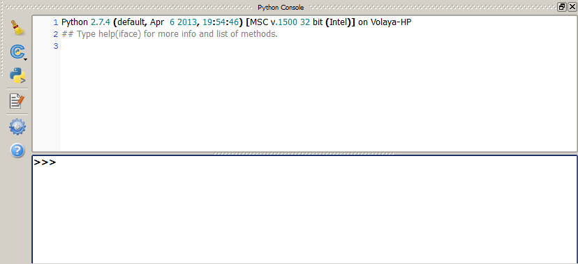
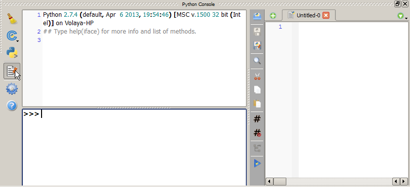
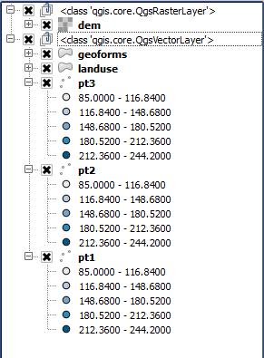

The QGIS Python console
========================

Introduction
*************

This lesson desribes how to use the Python console and show some example of some basic task. This will serve as an introduction to the QGIS API, which will be described in more detail in the next chapter

Data
*****

Sample data is provided in a sample project that you can download here. Unzip the zip file and open the QGIS project file that you will find. Feel free to use any other data for testing the examples in this chapter.

The Python console
*******************

The Python console allows to run Python commands within QGIS. It also gives access to the QGIS API, so you can interact with QGIS elements and do things such as adding a layer or retrieving the data corresponding to a given layer that is already open. Since all actions performed by plugins are likely to use QGIS element and act on them, knowledge of the QGIS API is fundamental. The console provides a very handy way of trying small snippets, and also to perform tasks that might not be worth putting into a plugin.

Let's start by opening the console. You can find it in *Plugins/Python console*. The console looks like this.

IF you plan to create scripts longer than a few lines, you have a text editor available with additional functionality. Click on the *Show editor* button to show it

The ``iface`` object
********************

As it is shown in the text shown in the console when you open it, you have a variable named ``iface`` available, which is the entry point to the QGIS API. This object is an instance of QgisInterface, which contains methods to access most of the elements in a running QGIS application.

Here is an example.

You can get the current active layer (the layer selected in the layer) by running

::

	>>> layer = iface.activeLayer()

Many plugins work on the current active layer, so this is an useful method.

The object returned is be a QgsMapLayer. Depending on the type of layer it is, it can be of several different classes, but it will always have a name, which can be retrieved using the ``name()`` method

::

	>>> print layer.name()
	"Elevation points"

We will see in detail how to deal with layer objects in the next chapter.

Try selecting a different layer and running these sentences again, to see how the printed name changes.

Working with layers
*******************

Two of the most useful method from the QgisInterface class are mapCanvas() and legendInterface(), which give acces to the map canvas and the legend, respectively. Since, ultimately, most of yor actions are going to have something to do with these elements, you are likely to find what you need in the objects that these methods return.

For instance, to get a list of all layers and not ust the active one, we can query the legend object

::

	>>> layers = iface.legendInterface().layers()

Groups are also part of the legend, and we can get a list of them or create new ones. The following is a script that classifies all layers in groups, so layers of the same class (belonging to the same Python class) will be grouped together. As it has been said, we will discuss those classes in detail soon, but for now we can just use their class names for this classification.

::

	legend = iface.legendInterface()
	layers = legend.layers()
	groups =  {}
	for layer in layers:
		groups.setdefault(type(layer),[]).append(layer)
	print groups
	for i, layertype in enumerate(groups):
		legend.addGroup(str(layertype), True, -1)
		for layer in groups[layertype]:
			legend.moveLayer(layer, 0)		

The ``True`` parameter passed to the ``addGroup`` method tells the method to expand the group after it is created. The ``-1`` value is the index of the parent group, since groups can be nested. Passing a ``-1`` value causes the group to have the legend root itself as parent. The new groups gets an index of 0, as it is inserted in the list of groups, and we can refer to it using that value.

If you had the sample project open and you have run the above script, now your legend should look like this:

The layers that were loaded have been divided in two groups, which correspond to vector and raster layers.

The map canvas object is another option for getting the layers that are being rendered, but it also can be used to get the current extent or modify it by zooming in or out.

The following code will get the current extent of the canvas.

::

	>>> rect = iface.mapCanvas().extent()
	>>> print rect
	<qgis.core.QgsRectangle object at 0x0E737C48>

The extent is returned as a ``QgsRectangle`` object. Layers also have a ``extent()`` method that returns a ``QgsRectangle``, so with a few lines of code we can have a list of all layers that will appear on the canvas considering its current extent. Below you can see the code to do that.

::
	
	>>>layers = iface.legendInterface().layers()
	>>>canvasExtent = iface.mapCanvas().extent()
	>>>inCanvas = [layer for layer in layer if layer.extent().intersects(canvasExtent)]
	>>>print "Layers in current canvas extent:\n\t-" + "\n\t-".join([layer.name for layer in inCanvas])
	Layers in current canvas extent:
		-dem
		-geoforms
		-landuse
		-pt3
		-pt2
		-pt1

Apart from using the layers that are already loaded in QGIS, you can add new layers from the console using the QgisInterface object directly.

To add a vector layer, use the ``addVectorlayer()`` method, which takes three parameters:
	
- A string representing the source of the layer data
- The name to use for the layer, which will be shown in the legend
- The provider that should take care of opening the data.

In the most common case, a file will be used as the layer source. In that case, the provider has to be ``ogr``, and the source is passed as the file path of the file to open, as in the following example.

::

	iface.addVectorLayer("/home/myuser/gisdata/mylayer.shp", "My vector layer", "ogr")

Other available providers are ``postgres`` (for PostGIS tables) and ``WFS`` (for connecting to a WFS service). The string representing the source is a URI that contains conenction information. We will see how to create them in the next chapter.

In the case of raster layers, you can use the ``addRasterLayer()`` method, which just takes the first two parameters.

::

	iface.addVectorLayer("/home/myuser/gisdata/mylayer.tif", "My raster layer")	