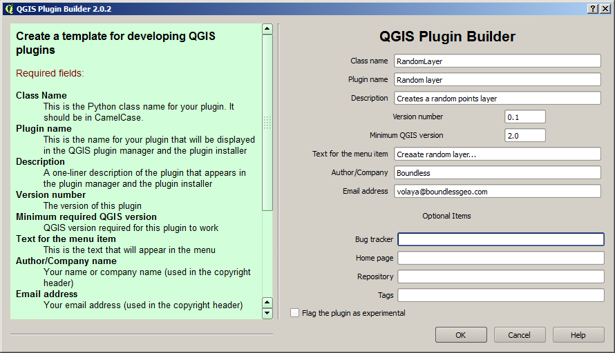

A plugin to create a random layer
==================================

Introduction
*************

In this lesson we will create a plugin that creates a random vector layer with the current extension of the canvas. This lesson introduces the classes and methods needed to create a vector layer. It also shows how to use access the QGIS canvas and retrieve information from it, and how to add new layers to it. 

Source Code
************

The plugin of this example plugin is available at the ``python/random_layer`` folder. It is recommended to try yourself to create it following the steps described below, before using the provided plugin code.

Creating the plugin base
*************************

To create the plugin skeleton, use the Plugin Builder with the following configuration.

Plugin implementation
************************

As in the two previous examples, we are not going to need to design UI elements for this plugin. The only user iteraction will be through a simple dialog, and we will use a predefined Qt one for that. That means we will have to work just on the ``run()`` and implement the plugin logic there. Although we are not using the ``ui_createrandomlayerplugin.ui`` file that the Plugin Builder will have created, do not delete it, since we will use it in the next lesson.

Our plugin will create a random points layer with the extension of the canvas, adding a number of points to be specified by the user. It should follow these steps:

- Ask the user for the number of points to add
- Generate the coordinates of the points to add, within the extent of the canvas
- Create a vector layer and add the points to it
- Add the vector layer to the canvas and legend

Here is the body of the ``run()`` method that implements the above actions.

::

    # run method that performs all the real work
    def run(self):
        npoints, ok = QInputDialog.getInt(self.iface.mainWindow(), "Number of points", "Enter number of points to add to layer", min = 1)
        if ok:
            #First we generate the point coordinates
            extent = self.iface.mapCanvas().extent()            
            coords = []
            for i in xrange(npoints):
                x = random.uniform(extent.xMinimum(), extent.xMaximum())
                y = random.uniform(extent.yMinimum(), extent.yMaximum())
                coords.append((x,y))
            
            #Then we create the layer
            uri = 'Point?crs=epsg:4326&field=id:integer'
            memLayer = QgsVectorLayer(uri, "Random points layer", 'memory')
            writer = memLayer.dataProvider()            

            features = []
            #and we populate it
            for i, coord in enumerate(coords):
                x,y = coord
                feature = QgsFeature()
                feature.setGeometry(QgsGeometry.fromPoint(QgsPoint(x,y)))
                feature.setAttributes([i])
                features.append(feature)

            writer.addFeatures(features)

            #And then we add the layer to the current project
            QgsMapLayerRegistry.instance().addMapLayers([memLayer])

The code could be more compact and efficient (for instance, computing the coordinates as point features are created), but it was structured like that to make it easier to understand it. Let's analize it.

The code block that computes coordinates is rather straighforward. It takes the boundary of the canvas a computes *x* and *y* values within that boundary, creating a lit of tuples.

The layer that is created after that to contain the points is a memory layer. We will see in the next lesson how to create a file-based layer, but in this case we are using a memory layer so we do not have to ask the user for a file path.

Notice that the way we are creating a layer is similar to what we saw in the XXXX chapter when we explained how to load a layer from a file. However, we are not using here the ``ogr`` string as the last parameter, since that is not the provider that is required in this case. Using ``memory`` as the provider descriptor tells QGIS that we want to create an in-memory layer. The advantage of that is that we can write new features to that layer without having to do anything else. The write that we need can be obtained calling the ``dataProvider()`` method.

In the case of opening a file-based layer, creating the ``QgsVectorLayer`` allows us to read features from it, but not to write to it. A different approach is needed in that case, and we will see it in the next chapter, as it has been said.

The first parameters is not a filepath now, since we do not need it, but a URI that describes the characteristics of the layer to create. In our case, we have:

::

	uri = 'Point?crs=epsg:4326&field=id:integer'

That indicates that we want a raster layer, using EPSG:4326 as its CRS, and that it should have a single integer field, named ``id`` in its attribute table. Multiple field descriptions are allowed.

The layer that is created and referenced by the ``memLayer`` variable is empty. To add points to it, we have to create features, each of them having a point geometry and an integer attribute, and then add those features.

To create a feature, we create an empty ``QgsFeature`` object and then set the geometry (created from the coordinates), and teh attributes. Attributes are passed as a simple list of objects, corresponding to the fields in the layer definition. Elements in the list must have the same order as fields when they were added to the layer definition.

Features are added to the layer all together, passing them in a list.

You will notice that we are not using the ``iface`` object in this case. The ``iface`` object provided methods to add a layer, taking as parameters the information needed to create that layer (URI, name, provider...). In this case we already have the layer created, so we are getting an instance of the map registry and adding our layer to it.

Compile and copy the plugin files to your QGIS plugin folder, and test the plugin to see that it works.

Notice that the coordinates of the canvas extent are used directly to create random points, without any transformation. Since we are using the EPSG:4326 CRS for our layer, that means that we are assuming that the canvas uses that CRS. That is, that the project CRS is EPSG:4326. This, of course, doesn't have to be true. In the next lesson we will see how to handle that, and we will add some other improvements to our random layer plugin.

