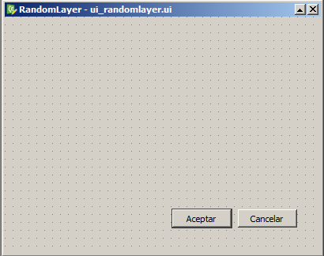
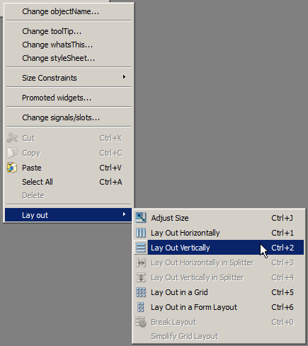
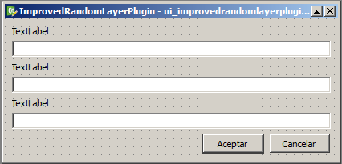

Our first UI. An improved random layer plugin
=============================================

Introduction
*************

In this lesson we will improve the random layer plugin by saving the layer to a file, adding extra checkings and providing more user interaction. We will get acquainted with Qt Designer, since we are going to create our own dialog to let the user has more control over the parameters used to create the random layer. We will also deal with projections and CRS.

Source Code
************

The plugin of this example plugin is available at the ``python/random_layer_dialog`` folder. It is recommended to try yourself to create it following the steps described below, before using the provided plugin code.

Plugin implementation
**********************************

Our random layer plugin is useful but still very simple. We can improve it by adding the following features.

- Selection of output CRS
- Automatic reprojection in case the project CRS is not the selected output one
- Saving the layer to a file instead of using a memory layer
- Progress information

We will need a more complex interface this time, since we need a filepath and a CRS, along with the number of points. Showing three simple input dialog is not a good idea, so we will be designing our own dialog.

You should have Qt installed in your system, and it comes with the Qt Designer appplication, which makes it easier to create dialogs. Open it.

.. image:: ../img/random_layer_dialog/designer.png

Click the *Open...* button and open the ``ui_randomlayerplugin.ui`` file where the empty dialog that is added by the Plugin Builder can be found.

You should see something like this.

The dialog is empty except for a button box in its lower part. You can add new elements by dragging and dropping from the widget box in the left-hand side of the window.

First, right click on the dialog (anywhere in the dialog body, not in the button box) and select *Lay out/Layout vertically*.

That will cause your widgets to organize themselves vertically.

Add three labels and three line edit widgets, to get something like this.

The position of each widget when you add it depends on the place where you drop it.

You can change the properties of an element by clicking on it and then modifying the corresponding property in the *Property editor* that can be found at the right-hand side of the window.

Change the text of the labels to *CRS*, *Filepath* and *Number of points* (the property to modify is named ``text``). The line edit object are named ``lineEdit``, ``lineEdit_2`` and ``lineEdit_3``. These are the names that will be used later as Python variables for refering to those items, so it is a good idea to change them. Change the ``objectName`` property and set the names to ``txtCrs``, ``txtFilepath`` and ``txtNPoints``.

Your dialog is now ready and it is now time to implement the logic of the dialog.

Close the Designer and open the ``randomlayerplugindialog.py`` file.

It has one class named RandomLayerPluginDialog

::

	class RandomLayerDialog(QtGui.QDialog):
	    def __init__(self):
	        QtGui.QDialog.__init__(self)
	        # Set up the user interface from Designer.
	        self.ui = Ui_RandomLayer()
	        self.ui.setupUi(self)

The ``Ui_RandomLayerPlugin`` class will be created by the ``compile`` task in the make file, based on the ``.ui`` file that we have created using Qt Designer. Calling its ``setupUi`` will take care of adding the widgets and creating the dialog itself. If we need some additional behaviour, we have to implement it manually in this class.

In this case, the only thing we need is to overwrite the ``accept()`` and ``reject()`` methods that are called when the ``OK`` and ``Cancel`` buttons are pressed. Here is the code for those two methods, along with a convenience method that is called to signal a wrong value in a field.

::
	
    def accept(self):
        self.filepath = self.ui.txtFilepath.text()
        authid = self.ui.txtCrs.text()
        self.crs = QgsCoordinateReferenceSystem(authid)
        if not self.crs.isValid():
            self.setYellowBackground(self.ui.txtCrs)
            return
        try:
            self.npoints = int(self.ui.txtNPoints.text())
        except ValueError:
            self.setYellowBackground(self.ui.txtNPoints)
            return
        if self.npoints < 1:
            self.setYellowBackground(self.ui.txtNPoints)
            return

        self.ok = True      
        QtGui.QDialog.accept(self)        
        
    def reject(self):       
        self.ok = False
        QtGui.QDialog.reject(self)   

    def setYellowBackground(self, widget):
        widget.setStyleSheet("QLineEdit{background: yellow}")  

When the dialog is accepted, we just take the strings from the text boxes, perform some light checks and if everything is fine, store the values and close the dialog.

The ``RandomLayerPluginDialog`` class now has to be called from the main plugin class, so whenever the corresponding action is triggered by clicking on the menu item, it displays the dialog and then uses the values that the user has entered.

Here you have the body of the ``run()`` method in the main plugin module.

::

    def run(self):
        dlg = RandomLayerDialog()
        dlg.exec_()
        if dlg.ok:
            try:
                self.writeLayerFile(dlg.filepath, dlg.npoints, dlg.crs)
            except Exception, e:
                print e
                self.iface.messageBar().pushMessage("Error creating layer", unicode(e),
                                              level = QgsMessageBar.CRITICAL)
                return

            self.iface.addVectorLayer(dlg.filepath, "Random points layer", "ogr")            

The layer creation has been moved to an independent method, and the ``run()`` methods now just calls it using the values entered by the user in the dialog. In case everything goes fine, it adds the layer to the layer registry. In case there is any problem, the ``createLayer()`` method will throw an exception, which will be caught and it message will be shown to the user. To do that, we are using the ``QgsMessageBar`` widget that is returned by the ``messageBar()`` method of our ``QgsInterface`` object. This is the recommended way of showing information to the user, since it is much less invasive than the classical message dialog. You will need to add the following import to be able to use the ``QgsMessageBar`` class, since it is not included in the code generate by the Plugin Builder.

::
    
    from qgis.gui import *

Let's have a look at how the layer is created now.

::

    def writeLayerFile(self, filepath, npoints, crs):     
        try:
            QApplication.setOverrideCursor(QCursor(Qt.WaitCursor))
            extent = self.iface.mapCanvas().extent()            
            
            #First we generate the point coordinates
            coords = []
            for i in xrange(npoints):
                x = random.uniform(extent.xMinimum(), extent.xMaximum())
                y = random.uniform(extent.yMinimum(), extent.yMaximum())
                coords.append((x,y))
                self.iface.mainWindow().statusBar().showMessage("Points computed: " + str(i))

            #Then we write the layer             
            fields = QgsFields()            
            fields.append(QgsField("id", QVariant.Int))
            writer = QgsVectorFileWriter(filepath, 'UTF-8', fields, QGis.WKBPoint, crs, "ESRI Shapefile")
            projectCrs = self.iface.mapCanvas().mapRenderer().destinationCrs()
            #and we populate it, reprojecting points if needed
            crsTransform = QgsCoordinateTransform(projectCrs, crs) 
            doReproject = projectCrs.authid() != crs.authid()
            for i, coord in enumerate(coords):
                x,y = coord
                pt = QgsGeometry.fromPoint(QgsPoint(x,y))
                if doReproject:
                    pt.transform(crsTransform)
                feature = QgsFeature()
                feature.setGeometry(pt)
                feature.setAttributes([i])
                writer.addFeature(feature)        
                self.iface.mainWindow().statusBar().showMessage("Points written to layer file: " + str(i))
        finally:
            QApplication.restoreOverrideCursor()          
            self.iface.mainWindow().statusBar().clearMessage()

The coordinates are computed in the same way as before, but we are reporting the progress of the operation, which is a good idea in case we have to add a large number of them. The mouse pointer is changed to an hour-glass pointer, to indicate that the plugin is working.  

Along with the message bar that we have already seen, we can use the QGIS status bar. In this case, we are using it to display a progress message indicating how many coordinates have been calculated so far.

::

	self.iface.mainWindow().statusBar().showMessage("Points computed: " + str(i))

Once we have the coordinates, the layer is created differently, with the following lines:

::

    fields = QgsFields()            
    fields.append(QgsField("id", QVariant.Int))
    writer = QgsVectorFileWriter(filepath, 'UTF-8', fields, QGis.WKBPoint, crs, "ESRI Shapefile")

We are passing the same information except for the file path (that is, geometry type, field descriptions and crs), but using the parameters of the constructor instead of a single URI to contain it. ``UTF-8`` refers to the encoding to use, and we are creating a shapefile, so we are passing the ``ESRI Shapefile`` string to indicate it.

Notice that we are not creating a layer here, but a writer that will take care of writing that shapefile with the random points. We are not returning anything from the method. If it finishes correctly, the file will have been created, and then we just add it using the ``addVectorLayer()`` method and passing the filepath to it.

Also, notice that we are not checking the filepath entered by the user at all. It can be a wrong path, or it can have an extension other that the required ``shp``. Adding the corresponding logic to check this and handle errors is left as an exercise for the reader.

As usual, you can compile and copy the code to test that the plugin works correctly.

Additional work
***************

Here are some ideas for further work

- Replace the ``txtFilepath`` text box with a label and a button that opens the standard file selection and puts the selected filepath in the label. That will give you guarantees that the filepath obtained from the dialog is a valid one.

- Display a messag in the message bar to inform that the layer has been correctly added.
